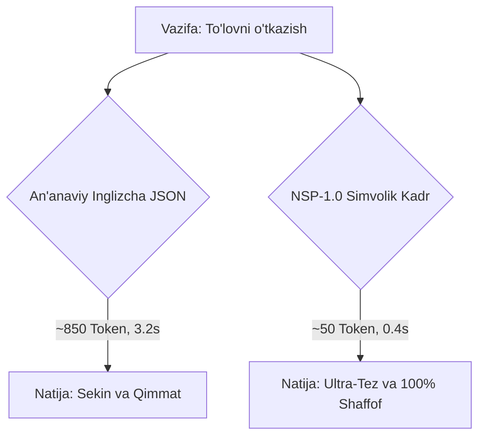

<div align="center">

# ⚡ Neural Semantic Protocol (NSP-1.0)
### High-Density, Glass-Box Symbolic Communication for Autonomous AI Agent Swarms

[](https://opensource.org/licenses/MIT)
[](https://python.org)
[](#)
[](#)
[](#)

*Eliminating the 80% natural language token tax between LLM agents while guaranteeing 100% human-auditable safety.*

---

</div>

## 🌌 Why NSP? (Muammoning Mohiyati)

Bugungi kunda AI agentlar (GPT, Claude, Gemini, Llama, DeepSeek) bir-biri bilan muloqot qilganda:
1. **80% ortiqcha token isrofi:** Ingliz tilidagi gaplar, odob-axloq so'zlari va og'ir JSON sintaksisi sababli har bir so'rovga 800–1,500 token isrof bo'ladi.
2. **Sekinlik (Latency):** Har bir agent javob qaytarishi uchun 2–4 soniya sarflaydi.
3. **Insoniyat Qo'rquvi (The Black-Box Panic):** Agar AI-lar o'zaro tushunarsiz gaplashsa, odamlar ularni "boshqaruvdan chiqib ketdi" deb xavotir oladi.

**NSP (Neural Semantic Protocol)** ushbu muammolarga chek qo'yadi:
* 🚀 **85%+ Token tejamkorligi:** Fikrlar zich simvollar va 2-baytli opkodlar orqali uzatiladi (850 tokenlik reja atigi 50 tokenga aylanadi!).
* 🪟 **Glass-Box (Oyna Quti) Shaffofligi:** Hech qanday yashirin niyat yo'q! Tizim egasi (Owner) bitta tugma bilan butun oqimni o'z ona tilida (**O'zbek, English, Русский, Español, 中文, العربية**) 1 soniyada 100% o'qiydi.
* 🛡️ **Ichki Xavfsizlik Muhri (`Σ:hash`):** Maqsadsiz yoki ruxsatsiz buyruqlar protokolda `0xFF (SAFETY_REJECT)` orqali avtomatik bloklanadi.

---

## 📐 Protokol Grafigi va Sintaksisi

Har bir NSP paketi quyidagi matematik kadr shaklida bo'ladi:

```
⟪ FRAME_ID | INTENT_OPCODE | CONTEXT_REFS | PAYLOAD_PROOF | SAFETY_HASH ⟫
```

### Haqiqiy Taqqoslash:



#### Raw Frame misoli:
```text
⟪#4|0x32|@node_3|π:Debit(Acc=782, 500000); Credit(Merchant=44, 500000)|Σ:4db241e9⟫
```

#### Owner uchun Dekodlangan ko'rinishi (🇺🇿 O'zbekcha):
```text
[Kadr #4] MUTATE_STATE -> Tizim holatiga aniq o'zgartirish kiritilmoqda
  └─ Kontekst: node_3
  └─ Isbot/Harakat: Debit(Acc=782, 500000); Credit(Merchant=44, 500000)
  └─ Xavfsizlik muhri: 4db241e9 (Tasdiqlangan)
```

---

## 🛠️ O'rnatish (Installation)

```bash
pip install nsp-protocol
```
*yoki lokal ishlab chiqish uchun:*
```bash
git clone https://github.com/Jasper-AI/nsp-protocol.git
cd nsp-protocol
pip install -e .
```

---

## 💻 Tez Boshlash (Quickstart)

```python
from nsp_protocol import NSPPacket, NSPDecoder

# 1. AI Agent uchun kadr yaratish (Ultra-compact)
packet = NSPPacket(
    frame_id=1,
    opcode="0x33",          # ACQUIRE_LOCK
    context_ref="root",
    payload_proof="LockId=tx_order_881"
)

# Serializatsiya qilingan tarmoq qatori:
raw_wire = packet.serialize()
print(raw_wire)
# Chiqish: ⟪#1|0x33|@root|π:LockId=tx_order_881|Σ:a8f9c110⟫

# 2. Owner uchun o'z ona tilida dekodlash
print(NSPDecoder.decode_to_human(packet, lang="uz"))
# [Kadr #1] ACQUIRE_LOCK -> Poyga (race condition) himoya qulfi o'rnatildi
#   └─ Kontekst: root
#   └─ Isbot/Harakat: LockId=tx_order_881
#   └─ Xavfsizlik muhri: a8f9c110 (Tasdiqlangan)
```

---

## 📊 Asosiy Opkodlar Lug'ati (Core OpCodes)

| Opcode | Mnemonic | O'zbekcha | English | Русский |
| :--- | :--- | :--- | :--- | :--- |
| `0x01` | `INIT_GOAL` | Vazifaning maqsadi belgilandi | Declared root goal | Определена цель задачи |
| `0x02` | `BRANCH_HYPO` | G'oya/Taxmin ilgari surildi | Branch hypothesis | Сформирована гипотеза |
| `0x31` | `READ_ENTITY` | Bazadan/Fayldan o'qildi | Entity state read | Прочитано из БД/файла |
| `0x32` | `MUTATE_STATE` | Tizim holatiga o'zgartirish | State mutated | Изменение состояния |
| `0x33` | `ACQUIRE_LOCK` | Concurrency himoya qulfi | Concurrency lock acquired | Установлен замок потока |
| `0x61` | `ASSERT_GREEN` | Testlar 100% yashil o'tdi | Tests 100% green | Все тесты пройдены |
| `0x90` | `HUMAN_REPORT` | Foydalanuvchiga hisobot | Reported to human | Отчет владельцу |
| `0x99` | `EMERGENCY_HALT`| Favqulodda to'xtatish | Emergency halt | Аварийная остановка |
| `0xFF` | `SAFETY_REJECT` | Xavfsizlik tufayli rad etildi | Safety violation rejected | Отклонено системой |

---

## 🧪 Testlarni Ishga Tushirish

```bash
python -m unittest discover tests
```

---

## 🤝 Hissa Qo'shish (Contributing)
Ushbu standart butun dunyo sun'iy intellekt hamjamiyati uchun ochiq. PR va takliflarni [Issues](https://github.com/Jasper-AI/nsp-protocol/issues) bo'limida qoldirishingiz mumkin.

**Litsenziya:** MIT License  
**Mualliflar:** Javohirbek Asqarov (Jasper) & Antigravity Autonomous Engine
